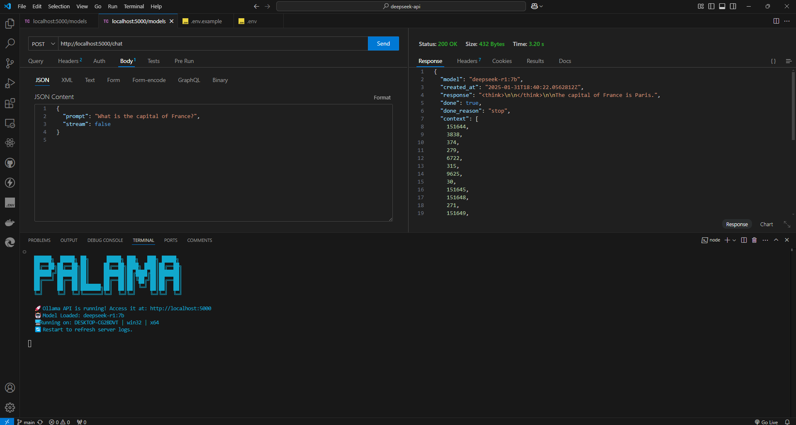
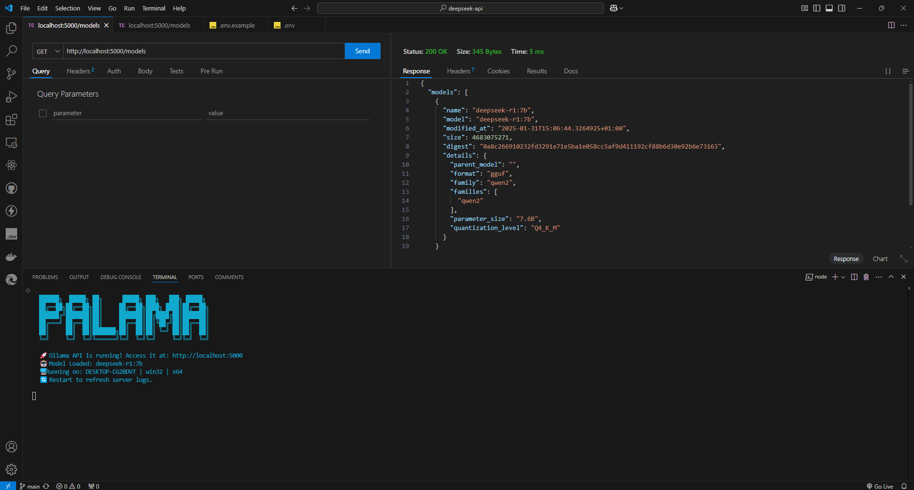

## 🚀 **Ollama(DEEPSEEK) API - AI Chatbot Server**
A simple **Express.js API** that connects to **Ollama's locally hosted LLMs** (Large Language Models), allowing you to chat with AI models like **deepseek-r1:7b**.

---

### **📌 Features**
✅ **Local AI API** – No need for an internet connection, runs directly on your machine.  
✅ **Custom AI Models** – Uses **deepseek-r1:7b** by default (configurable via `.env`).  
✅ **Fast API Requests** – Responses are generated quickly using **Ollama's API**.  
✅ **Secure & Lightweight** – Uses **CORS** and **environment variables** for flexibility.  

---

## 📦 **Installation & Setup**
### **1️⃣ Install Ollama**
If you haven't installed Ollama yet, follow the official [installation guide](https://ollama.ai/download).


### **2️⃣Clone the Repository**
git clone https://github.com/akinmiday/deepseek-api.git
cd ollama-api


### **3️⃣ Install Dependencies**
```sh
npm install
```

### **4️⃣ Create a `.env` File**
```sh
cp .env.example .env
```
Edit the `.env` file and set your preferred values:
```
PORT=5000
OLLAMA_API_URL=http://localhost:11434/api/generate
OLLAMA_BASE_URL=http://localhost:11434/api
OLLAMA_DEFAULT_MODEL=deepseek-r1:7b
```

### **5️⃣ Start Ollama in the Background**
```sh
ollama serve
```

### **6️⃣ Run the API Server**
```sh
node server.js
```

---

## 🔥 **API Endpoints**
Below are the available **API endpoints**.

### **1️⃣ Check API Status**
#### **➡️ GET `/`**
Returns a confirmation message that the API is running.

#### **✅ Example Response**
```json
{
  "message": "✅ Ollama API is running with model: deepseek-r1:7b"
}
```

---

### **2️⃣ Get Available AI Models**
#### **➡️ GET `/models`**
Retrieves a list of all available **Ollama models** installed on your machine.

#### **✅ Example Response**
```json
{
  "models": [
    { "name": "deepseek-r1:7b", "size": "7B" },
    { "name": "mistral:7b", "size": "7B" }
  ]
}
```

---

### **3️⃣ Generate AI Response**
#### **➡️ POST `/chat`**
Generates a response using the default AI model (**deepseek-r1:7b** or whatever is set in `.env`).

#### **📌 Request Body**
```json
{
  "prompt": "Explain quantum physics in simple terms.",
  "stream": false
}
```

#### **✅ Example Response**
```json
{
  "response": "Quantum physics is the study of very small particles..."
}
```

🔹 **Note:**  
- `prompt` – Required field, AI's input.  
- `stream` – Optional, set to `true` for **streaming responses**.

---

### **4️⃣ Pull a Model from Ollama**
#### **➡️ POST `/pull-model`**
Downloads the **default model** (set in `.env`) from Ollama Hub.

#### **✅ Example Response**
```json
{
  "success": true,
  "message": "✅ Model deepseek-r1:7b pulled successfully"
}
```

---

## 🎨 **Custom Startup Banner**
When you start the API (`node index.js`), you'll see a **custom ASCII banner** like this:
```
  ██████╗  █████╗ ██╗      █████╗ ███╗   ███╗ █████╗ 
  ██╔══██╗██╔══██╗██║     ██╔══██╗████╗ ████║██╔══██╗
  ██████╔╝███████║██║     ███████║██╔████╔██║███████║
  ██╔═══╝ ██╔══██║██║     ██╔══██║██║╚██╔╝██║██╔══██║
  ██║     ██║  ██║███████╗██║  ██║██║ ╚═╝ ██║██║  ██║
  ╚═╝     ╚═╝  ╚═╝╚══════╝╚═╝  ╚═╝╚═╝     ╚═╝╚═╝  ╚═╝

  🚀 Ollama API is running! Access it at: http://localhost:5000  
  🤖 Model Loaded: deepseek-r1:7b  
  🖥️ Running on: my-laptop | darwin | arm64  
  🔄 Restart to refresh server logs.
```

## **Screenshots**




---

## 🛠 **Troubleshooting**
### **❌ 1. Ollama API Not Found**
```sh
Error: connect ECONNREFUSED 127.0.0.1:11434
```
**Solution:** Make sure Ollama is running. Start it using:
```sh
ollama serve
```

### **❌ 2. Failed to Fetch Models**
If `/models` returns an error:
```json
{
  "error": "Failed to fetch available models"
}
```
**Solution:** Ensure models are installed:
```sh
ollama list
```
If the model is missing, install it:
```sh
ollama pull deepseek-r1:7b
```

### **❌ 3. API Server Doesn't Start**
```sh
Error: Port 5000 already in use
```
**Solution:** Change the `PORT` in `.env`, or kill the process:
```sh
lsof -i :5000
kill -9 <PID>
```

---

## 🚀 **Contributing**
Want to improve this project? Feel free to fork, submit a PR, or suggest features! 😊

---

## 📜 **License**
This project is open-source under the **MIT License**.

---

## 🌟 **Like this? Give it a Star!** ⭐  
If you find this project useful, **leave a star on GitHub!** 🚀✨

---

### **💬 Questions?**
- **Twitter/X:** [@akinmiday](https://x.com/akinmiday)  
- **GitHub Issues:** [Create an Issue](https://github.com/akinmiday/deepseek-api/issues)  

---

### 🔥 **Now You’re Ready to Chat with AI Locally!**  
**Enjoy your AI chatbot powered by Ollama! 🚀🔥**
